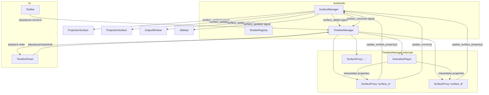

# Design Document: Animation Timeline

## Overview

The Animation Timeline adds keyframe-based animation to the ProjectionMapping app, enabling operators to animate surface properties (opacity, color, corners, visibility, z-index, fit mode) over time. The system leverages Godot's built-in `AnimationPlayer` and `Animation` resources as the runtime engine, bridged to the existing `SurfaceManager` data store through a proxy node pattern.

A new `TimelineManager` autoload singleton owns an `AnimationPlayer` and one `SurfaceProxy` child per surface. Each proxy exposes exported properties that `AnimationPlayer` value tracks can target. When the animation engine interpolates a proxy property, the proxy forwards the change to `SurfaceManager`, which emits `surface_updated` — the same signal path used by manual edits. This means `ProjectionSurface` nodes, the `OutputWindow`, and the `Sidebar` all react to animated changes with zero additional wiring.

A `TimelinePanel` Control node is inserted into the `UILayer` VBoxContainer between `MiddleArea` and `StatusBar`, providing a transport bar (play/pause/stop/seek/speed), surface track rows with expandable property sub-tracks, keyframe diamond indicators, and a draggable playhead.

Animation data is serialized as JSON alongside the existing surface config, enabling save/load round-trips. Phase 1 covers core playback, basic keyframing of value types (float, int, bool, Color, Vector2), the timeline panel, and serialization. Phase 2 defers shader param animation, content method tracks, BPM sync, queuing, zoom/snap, and rich keyframe editing UI.

## Architecture



**Key architectural decisions:**

1. **Proxy node pattern**: AnimationPlayer can only animate properties on nodes in the scene tree. SurfaceProxy nodes act as the bridge — they have exported properties that AnimationPlayer targets, and setter functions that forward changes to SurfaceManager. This avoids modifying SurfaceManager or ProjectionSurface.

2. **Corners as 4 separate Vector2 properties**: Godot's AnimationPlayer can interpolate Vector2 natively. Splitting the PackedVector2Array into `corner_tl`, `corner_tr`, `corner_br`, `corner_bl` allows per-corner keyframing and smooth interpolation. The proxy reconstructs the PackedVector2Array when forwarding to `update_corners()`.

3. **Single AnimationPlayer**: One AnimationPlayer per TimelineManager keeps playback state centralized. Multiple Animation resources (scenes) are swapped via `AnimationLibrary`.

4. **Signal-based integration**: All animated changes flow through the existing `surface_updated` signal, so ProjectionSurface, OutputWindow, and Sidebar react without modification.

5. **JSON serialization alongside config**: Animation data is stored under an `"animations"` key in the same config JSON that SurfaceManager uses, keeping everything in one file.


## Components and Interfaces

### 1. TimelineManager (`autoload/timeline_manager.gd`)

**Type:** Autoload singleton (registered in `project.godot`)

**Responsibilities:**
- Hosts the `AnimationPlayer` and all `SurfaceProxy` children
- Manages `AnimationLibrary` containing all Animation resources (scenes)
- Provides the playback API (play, pause, stop, seek, step, speed)
- Creates/removes proxy nodes in response to SurfaceManager signals
- Manages animation scene CRUD (create, delete, rename, set duration, set loop mode)
- Serializes/deserializes animation data to/from JSON
- Emits signals for UI updates

**Signals:**
```gdscript
signal playback_state_changed(is_playing: bool)
signal playhead_moved(time: float)
signal animation_scene_changed(scene_name: String)
signal animation_list_changed()
signal track_changed(surface_id: String, property: String)
```

**Public API:**
```gdscript
# Playback
func play() -> void
func pause() -> void
func stop() -> void
func seek(time: float) -> void
func step_forward() -> void
func step_backward() -> void
func set_speed(multiplier: float) -> void
func get_speed() -> float
func is_playing() -> bool
func get_playhead_time() -> float
func get_duration() -> float

# Animation scene management
func create_scene(name: String, duration: float) -> void
func delete_scene(name: String) -> void
func rename_scene(old_name: String, new_name: String) -> void
func set_active_scene(name: String) -> void
func get_active_scene_name() -> String
func get_scene_names() -> Array[String]
func set_scene_duration(name: String, duration: float) -> void
func set_scene_loop_mode(name: String, loop: bool) -> void
func get_scene_loop_mode(name: String) -> bool

# Keyframe editing
func add_keyframe(surface_id: String, property: String, time: float, value: Variant, easing: String) -> void
func remove_keyframe(surface_id: String, property: String, time: float) -> void
func move_keyframe(surface_id: String, property: String, old_time: float, new_time: float) -> void
func update_keyframe_value(surface_id: String, property: String, time: float, value: Variant) -> void
func update_keyframe_easing(surface_id: String, property: String, time: float, easing: String) -> void
func get_keyframes(surface_id: String, property: String) -> Array[Dictionary]

# Track armability
func set_track_armed(surface_id: String, property: String, armed: bool) -> void
func is_track_armed(surface_id: String, property: String) -> bool
func get_armed_tracks(surface_id: String) -> Array[String]

# Serialization
func serialize_animations() -> Dictionary
func deserialize_animations(data: Dictionary) -> void

# Proxy access
func get_proxy(surface_id: String) -> Node
```

### 2. SurfaceProxy (`scripts/surface_proxy.gd`)

**Type:** Node (child of TimelineManager, one per surface)

**Responsibilities:**
- Exposes exported properties that AnimationPlayer value tracks target
- Forwards property changes to SurfaceManager via setters
- Reconstructs PackedVector2Array from individual corner Vector2 properties

**Exported Properties:**
```gdscript
var surface_id: String  # Set at creation, not animated

# Animatable properties with setters
var opacity: float = 1.0:
    set(value): _set_property("opacity", value)
var color: Color = Color.WHITE:
    set(value): _set_property("color", "#" + value.to_html(false))
var visible_prop: bool = true:
    set(value): _set_property("visible", value)
var z_index_prop: int = 0:
    set(value): _set_property("z_index", value)
var corner_tl: Vector2 = Vector2.ZERO:
    set(value): _set_corner(0, value)
var corner_tr: Vector2 = Vector2.ZERO:
    set(value): _set_corner(1, value)
var corner_br: Vector2 = Vector2.ZERO:
    set(value): _set_corner(2, value)
var corner_bl: Vector2 = Vector2.ZERO:
    set(value): _set_corner(3, value)
var fit_mode: String = "stretch":
    set(value): _set_property("fit_mode", value)
```

**Internal Methods:**
```gdscript
func _set_property(key: String, value: Variant) -> void:
    # Forward to SurfaceManager
    SurfaceManager.update_surface_property(surface_id, key, value)

func _set_corner(index: int, value: Vector2) -> void:
    # Update local corner, reconstruct array, forward
    _corners[index] = value
    SurfaceManager.update_corners(surface_id, PackedVector2Array(_corners))

func sync_from_surface() -> void:
    # Read current values from SurfaceManager into proxy properties
    # Used when animation stops or when proxy is first created
```

**Design rationale:** Properties use GDScript setters so that AnimationPlayer's property interpolation automatically triggers the forwarding logic. The `_corners` array is a local cache of 4 Vector2 values; when any single corner changes, the full PackedVector2Array is reconstructed and sent to `update_corners()`.

### 3. TimelinePanel (`scripts/timeline_panel.gd`)

**Type:** VBoxContainer (inserted into UILayer between MiddleArea and StatusBar)

**Responsibilities:**
- Displays the transport bar with playback controls
- Displays scrollable track rows (one per surface, expandable to property sub-tracks)
- Displays keyframe diamonds on tracks
- Displays and allows dragging of the playhead
- Supports collapse to transport-bar-only strip

**Sub-components (built programmatically):**

```
TimelinePanel (VBoxContainer)
├── TransportBar (HBoxContainer)
│   ├── PlayPauseBtn (Button)
│   ├── StopBtn (Button)
│   ├── StepBackBtn (Button)
│   ├── StepFwdBtn (Button)
│   ├── TimeLabel (Label) — "00:00.00"
│   ├── LoopToggle (Button, toggle_mode)
│   ├── SpeedSelector (OptionButton) — 0.1x..4.0x
│   ├── SceneSelector (OptionButton) — animation scene picker
│   ├── NewSceneBtn (Button)
│   └── CollapseBtn (Button) — toggle panel height
├── TrackArea (ScrollContainer)
│   └── TrackContainer (VBoxContainer)
│       ├── SurfaceTrackRow (HBoxContainer) — per surface
│       │   ├── TrackHeader (HBoxContainer) — label, expand toggle, arm toggles
│       │   └── KeyframeStrip (Control) — custom draw for diamonds + playhead
│       └── PropertySubTrackRow (HBoxContainer) — per armed property
│           ├── PropertyLabel (Label)
│           ├── ArmToggle (CheckButton)
│           └── KeyframeStrip (Control)
└── PlayheadOverlay (Control) — vertical line drawn over full track area
```

**Key interactions:**
- Double-click on empty track area → add keyframe at that time with current value
- Click-drag keyframe diamond → move keyframe in time
- Right-click keyframe → context menu (Edit Value, Change Easing, Delete)
- Click-drag playhead → seek animation
- Click surface row header → expand/collapse property sub-tracks

### 4. Toolbar Additions

The existing `Toolbar` (`scripts/toolbar.gd`) gains no new buttons for Phase 1. Playback controls live entirely in the `TimelinePanel`'s `TransportBar`. The Space bar shortcut for play/pause is handled in `app.gd` and delegated to `TimelineManager`.

### 5. Integration Points

**SurfaceManager → TimelineManager:**
- `surface_added` signal → `TimelineManager._on_surface_added(id)` → creates SurfaceProxy
- `surface_removed` signal → `TimelineManager._on_surface_removed(id)` → frees SurfaceProxy

**TimelineManager → SurfaceManager:**
- SurfaceProxy setters call `SurfaceManager.update_surface_property()` and `SurfaceManager.update_corners()`
- This triggers `surface_updated` signal → ProjectionSurface, OutputWindow, Sidebar all react

**TimelineManager → TimelinePanel:**
- `playback_state_changed` → update play/pause button state
- `playhead_moved` → update playhead position and time label
- `animation_scene_changed` → refresh track display
- `animation_list_changed` → refresh scene selector
- `track_changed` → refresh keyframe display for affected track

**App.gd → TimelineManager:**
- Space bar → `TimelineManager.play()` or `TimelineManager.pause()`
- Home/End/Left/Right arrow keys → seek/step operations
- Delete key (when keyframe selected) → remove keyframe

**Serialization hook:**
- `SurfaceManager.save_config()` calls `TimelineManager.serialize_animations()` and includes result under `"animations"` key
- `SurfaceManager.load_config()` passes `data.get("animations", {})` to `TimelineManager.deserialize_animations()`

**App.tscn layout change:**
The `TimelinePanel` node is added to `UILayer` VBoxContainer between `MiddleArea` and `StatusBar`:
```
UILayer (VBoxContainer)
├── Toolbar
├── MiddleArea
├── TimelinePanel  ← NEW
└── StatusBar
```


## Data Models

### Animation Scene Model

Each animation scene maps to a Godot `Animation` resource stored in an `AnimationLibrary` on the `AnimationPlayer`. The TimelineManager maintains a parallel metadata dictionary for UI state (armed tracks, scene names).

```gdscript
# Internal metadata per animation scene
var _scenes: Dictionary = {}  # scene_name -> SceneMetadata

class SceneMetadata:
    var name: String
    var duration: float
    var loop_mode: String  # "none" or "loop"
    var armed_tracks: Dictionary  # surface_id -> Array[String] of armed property names
```

### Track → AnimationPlayer Mapping

Each animatable property on a surface maps to one track in the Godot `Animation` resource:

| Surface Property | Track Path | Track Type | Value Type |
|---|---|---|---|
| opacity | `SurfaceProxy_{id}:opacity` | VALUE | float |
| color | `SurfaceProxy_{id}:color` | VALUE | Color |
| visible | `SurfaceProxy_{id}:visible_prop` | VALUE | bool |
| z_index | `SurfaceProxy_{id}:z_index_prop` | VALUE | int |
| corner_tl | `SurfaceProxy_{id}:corner_tl` | VALUE | Vector2 |
| corner_tr | `SurfaceProxy_{id}:corner_tr` | VALUE | Vector2 |
| corner_br | `SurfaceProxy_{id}:corner_br` | VALUE | Vector2 |
| corner_bl | `SurfaceProxy_{id}:corner_bl` | VALUE | Vector2 |
| fit_mode | `SurfaceProxy_{id}:fit_mode` | VALUE | String |

Track paths use the proxy node name as the base, which is `SurfaceProxy_{surface_id}`. The AnimationPlayer resolves these paths relative to its parent (TimelineManager).

### Easing Type Mapping

Easing types map to Godot's `Animation.TransitionType`:

| Easing Name | Godot Constant |
|---|---|
| linear | `Animation.TRANS_LINEAR` |
| ease_in | `Animation.TRANS_QUAD` + `Animation.EASE_IN` |
| ease_out | `Animation.TRANS_QUAD` + `Animation.EASE_OUT` |
| ease_in_out | `Animation.TRANS_QUAD` + `Animation.EASE_IN_OUT` |
| cubic | `Animation.TRANS_CUBIC` + `Animation.EASE_IN_OUT` |

### JSON Serialization Format

```json
{
  "animations": {
    "version": 1,
    "active_scene": "Scene 1",
    "scenes": [
      {
        "name": "Scene 1",
        "duration": 10.0,
        "loop_mode": "loop",
        "armed_tracks": {
          "surface_abc123": ["opacity", "corner_tl", "corner_tr"]
        },
        "tracks": [
          {
            "surface_id": "surface_abc123",
            "property": "opacity",
            "track_type": "value",
            "keys": [
              { "time": 0.0, "value": 1.0, "easing": "linear" },
              { "time": 5.0, "value": 0.0, "easing": "ease_out" },
              { "time": 10.0, "value": 1.0, "easing": "ease_in" }
            ]
          },
          {
            "surface_id": "surface_abc123",
            "property": "corner_tl",
            "track_type": "value",
            "keys": [
              { "time": 0.0, "value": [100.0, 100.0], "easing": "linear" },
              { "time": 10.0, "value": [200.0, 150.0], "easing": "cubic" }
            ]
          },
          {
            "surface_id": "surface_abc123",
            "property": "color",
            "track_type": "value",
            "keys": [
              { "time": 0.0, "value": "#4488FF", "easing": "linear" },
              { "time": 5.0, "value": "#FF8833", "easing": "ease_in_out" }
            ]
          }
        ]
      }
    ]
  }
}
```

**Value serialization rules:**
- `float` → JSON number
- `int` → JSON integer
- `bool` → JSON boolean
- `String` → JSON string
- `Color` → JSON string as `"#RRGGBB"` hex
- `Vector2` → JSON array `[x, y]`

**Deserialization rules:**
- Property type is inferred from the property name using a static type map
- Unknown properties are skipped with a warning
- Missing surfaces are skipped with a warning (Requirement 12.1)
- Unknown easing types fall back to `"linear"` (Requirement 12.2)

### Armability State

Track armability is stored per-scene in the `armed_tracks` dictionary. The TimelinePanel uses this to determine which property sub-tracks to display:

- **Armed + has keyframes** → shown, fully interactive
- **Armed + no keyframes** → shown, ready for keyframing
- **Disarmed + has keyframes** → shown but dimmed, keyframes preserved
- **Disarmed + no keyframes** → hidden

Default armed state for new surfaces: `opacity` and `visible` are armed by default. All other properties start disarmed.


## Correctness Properties

*A property is a characteristic or behavior that should hold true across all valid executions of a system — essentially, a formal statement about what the system should do. Properties serve as the bridge between human-readable specifications and machine-verifiable correctness guarantees.*

### Property 1: Proxy-surface count invariant

*For any* sequence of surface additions and removals on SurfaceManager, the number of SurfaceProxy children on TimelineManager shall always equal the number of surfaces in `SurfaceManager.surfaces`, and each surface shall have exactly one corresponding proxy with a matching `surface_id`.

**Validates: Requirements 1.3, 1.4**

### Property 2: Proxy property forwarding

*For any* SurfaceProxy and any animatable property (opacity, color, visible, z_index, corner_tl, corner_tr, corner_br, corner_bl, fit_mode), setting the property on the proxy shall result in the corresponding value being reflected in the SurfaceManager surface dictionary. For corner properties, the reconstructed PackedVector2Array in SurfaceManager shall contain the updated Vector2 at the correct index.

**Validates: Requirements 1.7**

### Property 3: Animation scene CRUD round-trip

*For any* valid scene name and positive duration, creating an animation scene and then querying the scene list shall include that scene. Deleting a scene shall remove it from the list. Renaming a scene shall preserve all track data while updating the name. Creating then deleting a scene shall return the scene list to its prior state.

**Validates: Requirements 2.1, 2.2, 2.3**

### Property 4: Scene metadata set/get consistency

*For any* existing animation scene, setting the loop mode to a valid value ("none" or "loop") and then getting it shall return the same value. Setting the duration to any positive float and then getting it shall return the same value. The active scene shall always be either empty or a name present in the scene list.

**Validates: Requirements 2.5, 2.6, 2.7, 2.8**

### Property 5: Keyframe add/remove round-trip

*For any* valid surface id, animatable property, time within the animation duration, and type-appropriate value, adding a keyframe and then querying keyframes for that track shall include a keyframe at that time with the given value and "linear" easing. Removing that keyframe shall result in it no longer appearing in the track's keyframe list.

**Validates: Requirements 3.1, 3.2**

### Property 6: Keyframe mutation preserves identity

*For any* existing keyframe, moving it to a new valid time shall preserve its value and easing while updating only the time. Updating its value shall preserve the time and easing. Updating its easing to any of the 5 valid easing types (linear, ease_in, ease_out, ease_in_out, cubic) shall preserve the time and value.

**Validates: Requirements 3.3, 3.4, 3.5, 3.6**

### Property 7: Playback state machine

*For any* animation scene with duration > 0, calling `play()` shall set `is_playing()` to true. Calling `pause()` while playing shall set `is_playing()` to false while preserving the playhead position. Calling `stop()` shall set `is_playing()` to false and reset the playhead to 0.0. Toggling play/pause twice shall return to the original playing state.

**Validates: Requirements 4.1, 4.2, 4.3, 7.1**

### Property 8: Seek and step clamping

*For any* animation scene with a given duration, seeking to any time shall clamp the playhead to `[0.0, duration]`. Stepping forward from any position shall add `1.0/60.0` seconds, clamped at the duration. Stepping backward from any position shall subtract `1.0/60.0` seconds, clamped at 0.0. Seeking to 0.0 (Home) and seeking to duration (End) shall always produce exactly those values.

**Validates: Requirements 4.4, 4.5, 4.6, 7.5, 7.6, 7.7, 7.8**

### Property 9: Speed multiplier clamping

*For any* float value, setting the playback speed shall clamp it to the range `[0.1, 4.0]` and the stored value shall equal the clamped input. The default speed shall be 1.0.

**Validates: Requirements 4.7**

### Property 10: Serialization round-trip

*For any* valid set of animation scenes (each with a name, positive duration, valid loop mode, and tracks containing keyframes with valid times, type-appropriate values, and valid easing types), serializing to JSON and then deserializing shall produce an equivalent set of animation scenes with identical names, durations, loop modes, track properties, and keyframe data.

**Validates: Requirements 9.1, 9.2, 9.3, 9.4, 9.5, 9.7**

### Property 11: Keyframe time clamping

*For any* animation scene with a given duration and any keyframe time value greater than the duration, adding the keyframe shall result in its time being clamped to the animation duration. For any keyframe time value less than 0.0, the time shall be clamped to 0.0.

**Validates: Requirements 12.5**

### Property 12: Track visibility rules

*For any* surface and any animatable property, the track visibility in the timeline panel shall follow these rules: if the track is armed, it is visible. If the track is disarmed and has no keyframes, it is hidden. If the track is disarmed and has keyframes, it is visible but marked as dimmed. Toggling arm state shall immediately update visibility. Disarming a track with keyframes shall preserve all keyframes.

**Validates: Requirements 13.2, 13.3, 13.4, 13.5, 13.6**

### Property 13: Missing surface graceful skip

*For any* animation scene containing tracks that reference surface IDs not present in SurfaceManager, deserializing and playing the animation shall skip those tracks without error, and all tracks referencing valid surfaces shall play correctly.

**Validates: Requirements 12.1**

### Property 14: Unknown easing fallback

*For any* keyframe in serialized JSON with an easing string that is not one of the 5 valid types, deserializing shall assign "linear" easing to that keyframe and all other keyframe data shall be preserved.

**Validates: Requirements 12.2**

### Property 15: Malformed JSON recovery

*For any* string that is not valid JSON or valid JSON that does not conform to the expected animation schema, calling `deserialize_animations()` shall result in an empty animation list without throwing an error, and the TimelineManager shall remain in a usable state.

**Validates: Requirements 12.3**


## Error Handling

### Deserialization Errors

| Error Condition | Behavior |
|---|---|
| Missing `"animations"` key in config JSON | Initialize with empty animation list, continue normally (Req 9.6) |
| Malformed JSON in animations data | Discard animation data, initialize empty, log error (Req 12.3) |
| Track references non-existent surface ID | Skip track during playback and deserialization, log warning (Req 12.1) |
| Keyframe has unrecognized easing type | Fall back to `"linear"`, log warning (Req 12.2) |
| Keyframe value type mismatch for property | Skip keyframe, log warning |
| Animation scene with empty name | Skip scene, log warning |
| Animation scene with duration ≤ 0 | Clamp to minimum 0.1 seconds, log warning |

### Runtime Errors

| Error Condition | Behavior |
|---|---|
| Keyframe added beyond animation duration | Clamp time to duration (Req 12.5) |
| Keyframe added at negative time | Clamp time to 0.0 |
| Speed multiplier outside [0.1, 4.0] | Clamp to nearest bound |
| Play called with no active animation scene | No-op, log warning |
| Seek called with no active animation scene | No-op |
| Delete scene that doesn't exist | No-op, log warning |
| Rename scene to name that already exists | Reject rename, log warning |
| Proxy receives update for freed surface | Guard with `is_instance_valid()`, skip if invalid |

### Signal Safety

- SurfaceProxy setters check `SurfaceManager.get_surface(surface_id).is_empty()` before forwarding, to avoid errors if the surface was removed between frames.
- TimelineManager disconnects signals from SurfaceManager in `_exit_tree()` to prevent dangling connections.
- AnimationPlayer's `animation_finished` signal is connected to handle one-shot mode end-of-playback.

## Testing Strategy

### Dual Testing Approach

The animation timeline feature requires both unit tests and property-based tests for comprehensive coverage:

- **Unit tests**: Verify specific examples, edge cases, integration points, and UI structure
- **Property-based tests**: Verify universal properties across randomly generated inputs using the [GdUnit4](https://github.com/MikeSchulze/gdUnit4) framework with its built-in fuzzing/parameterized test support

Since Godot 4.5 / GDScript does not have a mature property-based testing library equivalent to QuickCheck or Hypothesis, property-based tests will be implemented as parameterized GdUnit4 tests with custom random generators that produce randomized inputs across 100+ iterations per property.

### Property-Based Test Configuration

- **Framework**: GdUnit4 (GDScript test framework for Godot)
- **Minimum iterations**: 100 per property test
- **Random seed**: Configurable for reproducibility
- **Each property test must reference its design document property**
- **Tag format**: `# Feature: animation-timeline, Property {number}: {property_text}`

### Test Organization

```
tests/
├── test_timeline_manager.gd        — Unit + property tests for TimelineManager API
├── test_surface_proxy.gd           — Unit + property tests for SurfaceProxy forwarding
├── test_animation_serialization.gd — Property tests for serialization round-trip
├── test_playback_controls.gd       — Property tests for playback state machine, seek, speed
├── test_keyframe_editing.gd        — Property tests for keyframe CRUD and mutation
├── test_track_visibility.gd        — Property tests for arm/disarm visibility rules
└── test_error_handling.gd          — Property tests for error recovery (missing surfaces, bad easing, malformed JSON)
```

### Unit Test Coverage

Unit tests cover specific examples and edge cases not suited to property-based testing:

- TimelineManager has exactly one AnimationPlayer child after `_ready()` (Req 1.2)
- SurfaceProxy exposes all 9 required properties with correct types (Req 1.5)
- TimelinePanel is positioned between MiddleArea and StatusBar in UILayer (Req 5.1)
- TimelinePanel default height is 200px, minimum 100px (Req 5.2)
- TransportBar contains all required controls (Req 5.3)
- TimelinePanel collapse toggle works (Req 5.11)
- One-shot playback stops at end (Req 4.9)
- Empty animations key in config loads without error (Req 9.6)

### Property Test → Design Property Mapping

| Test File | Properties Covered |
|---|---|
| `test_timeline_manager.gd` | Property 1 (proxy count), Property 3 (scene CRUD), Property 4 (metadata) |
| `test_surface_proxy.gd` | Property 2 (forwarding) |
| `test_animation_serialization.gd` | Property 10 (round-trip), Property 13 (missing surface), Property 14 (unknown easing), Property 15 (malformed JSON) |
| `test_playback_controls.gd` | Property 7 (state machine), Property 8 (seek/step), Property 9 (speed) |
| `test_keyframe_editing.gd` | Property 5 (add/remove), Property 6 (mutation), Property 11 (time clamping) |
| `test_track_visibility.gd` | Property 12 (visibility rules) |

Each property-based test must:
1. Be tagged with a comment: `# Feature: animation-timeline, Property N: <title>`
2. Run a minimum of 100 iterations with randomized inputs
3. Use a seeded random number generator for reproducibility
4. Assert the universal quantification stated in the property

