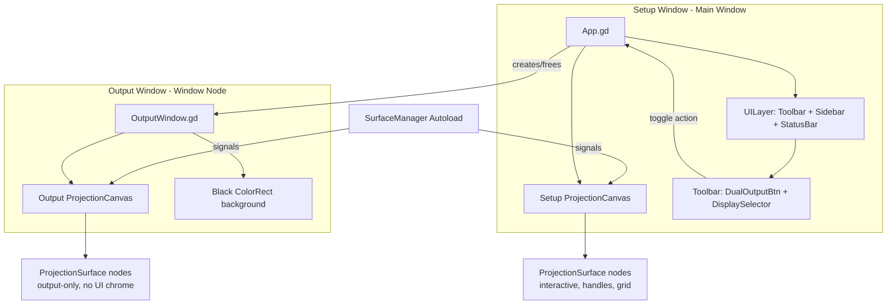
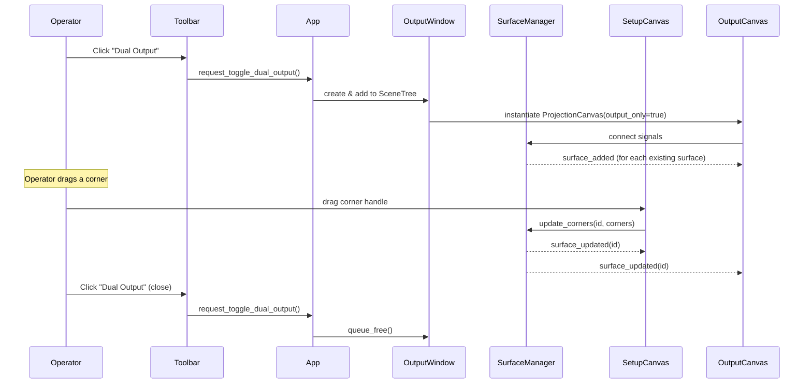

# Design Document: Dual Window Output

## Overview

The Dual Window Output feature adds a second Godot `Window` node that renders projection surfaces fullscreen on a chosen display, while the operator retains full control in the primary Setup Window. Both windows read from the same `SurfaceManager` singleton — the Output Window simply instantiates its own `ProjectionCanvas` that listens to the same signals but suppresses all interactive UI (handles, selection borders, grids).

The existing single-window Output Mode (F11/Tab) is preserved as a fallback. When the Output Window is open, the single-window toggle is disabled to prevent conflicting states.

### Key Design Decisions

1. **Separate surface node instances, shared data** — The Output Window's `ProjectionCanvas` creates its own `ProjectionSurface` nodes. These nodes read from `SurfaceManager` dictionaries (the source of truth) but never write back. This avoids cross-window node ownership issues in Godot's scene tree.

2. **Window node, not a second SceneTree** — Godot 4.x `Window` nodes run inside the same process and SceneTree, so the Output Window can access autoloads (`SurfaceManager`, `ShaderRegistry`) directly. No IPC needed.

3. **Output surfaces skip interactive features** — Output `ProjectionSurface` nodes don't create corner handles, don't process input events, and don't draw selection/grid overlays. This is controlled by an `output_only` flag passed at initialization.

4. **Display targeting via DisplayServer** — `DisplayServer.get_screen_count()` and `DisplayServer.screen_get_position(idx)` position the Window on the correct display. The selected display index is persisted in the config.

## Architecture



### Signal Flow

All surface mutations go through `SurfaceManager`. Both canvases react identically to `surface_added`, `surface_removed`, `surface_updated` signals. The Output Canvas simply renders without interactive overlays.



## Components and Interfaces

### 1. OutputWindow (new script: `scripts/output_window.gd`)

A script attached to a `Window` node. Responsible for creating the output-only rendering environment.

```gdscript
class_name OutputWindow
extends Window

signal output_window_closed()

var output_canvas: Control  # ProjectionCanvas instance

func _ready() -> void:
    # Configure window: borderless, unresizable, 1920x1080
    # Add black ColorRect background
    # Instantiate ProjectionCanvas in output-only mode
    # Sync existing surfaces from SurfaceManager

func open_on_display(display_index: int) -> void:
    # Position window at DisplayServer.screen_get_position(display_index)
    # Set size to 1920x1080
    # Show and make fullscreen (borderless)

func _on_close_requested() -> void:
    # Emit output_window_closed so App can update toolbar state
    # Clean up and queue_free
```

### 2. ProjectionCanvas modifications (`scripts/projection_canvas.gd`)

Add an `output_only` mode flag. When true:
- Surface nodes are initialized with `output_only = true`
- No input processing (click-to-deselect disabled)
- No surface selection handling

```gdscript
# New property
var output_only: bool = false

func initialize_output_mode() -> void:
    output_only = true
    # Connect to SurfaceManager signals
    # Sync all existing surfaces

func _on_surface_added(id: String) -> void:
    var node = surface_scene.instantiate()
    add_child(node)
    node.initialize(id, output_only)  # pass output_only flag
    surface_nodes[id] = node
```

### 3. ProjectionSurface modifications (`scripts/projection_surface.gd`)

Add `output_only` flag to skip interactive features:

```gdscript
var output_only: bool = false

func initialize(id: String, p_output_only: bool = false) -> void:
    output_only = p_output_only
    # ... existing init ...
    if output_only:
        # Don't create corner handles
        # Don't connect to input events
        # Don't draw selection borders or grids
```

When `output_only` is true:
- `_create_corner_handles()` is skipped
- `_draw()` skips selection border and grid rendering
- `_input()` returns immediately
- `_on_mode_changed()` is not connected
- Content loading (shader, video, web, image) works identically

### 4. Toolbar modifications (`scripts/toolbar.gd`)

New UI elements:
- **DualOutputBtn** — `Button` that toggles the Output Window
- **DisplaySelector** — `OptionButton` dropdown listing connected displays

```gdscript
@onready var dual_output_btn: Button = %DualOutputBtn
@onready var display_selector: OptionButton = %DisplaySelector

var _is_dual_output_active: bool = false

func _ready() -> void:
    # ... existing ...
    _populate_display_selector()
    dual_output_btn.pressed.connect(_on_dual_output_pressed)

func _populate_display_selector() -> void:
    display_selector.clear()
    var count := DisplayServer.get_screen_count()
    for i in range(count):
        var size := DisplayServer.screen_get_size(i)
        display_selector.add_item("Display %d (%dx%d)" % [i, size.x, size.y], i)
    # Default to secondary display if available
    if count > 1:
        display_selector.selected = 1

func set_dual_output_active(active: bool) -> void:
    _is_dual_output_active = active
    dual_output_btn.text = "■ Stop Output" if active else "▶ Dual Output"
    display_selector.disabled = active

func get_selected_display() -> int:
    return display_selector.get_selected_id()
```

### 5. App.gd modifications (`scripts/app.gd`)

Manages Output Window lifecycle and keyboard shortcuts:

```gdscript
var _output_window: Window = null

func toggle_dual_output() -> void:
    if _output_window:
        _close_output_window()
    else:
        _open_output_window()

func _open_output_window() -> void:
    var display_idx := toolbar.get_selected_display()
    _output_window = OutputWindow.new()
    add_child(_output_window)
    _output_window.open_on_display(display_idx)
    _output_window.output_window_closed.connect(_on_output_window_closed)
    toolbar.set_dual_output_active(true)

func _close_output_window() -> void:
    if _output_window:
        _output_window.queue_free()
        _output_window = null
    toolbar.set_dual_output_active(false)

func _unhandled_key_input(event: InputEvent) -> void:
    # ... existing ...
    # Add Ctrl+D for dual output toggle
    # Block F11/Tab when Output Window is open
```

### 6. SurfaceManager additions (`autoload/surface_manager.gd`)

New fields for display preference persistence:

```gdscript
var preferred_display_index: int = 1  # default to secondary

func set_preferred_display(index: int) -> void:
    preferred_display_index = index

func get_preferred_display() -> int:
    return preferred_display_index
```

Serialization updated to include `preferred_display_index` in the config JSON under the `"app"` key.


## Data Models

### Existing Data (SurfaceManager)

No changes to the surface dictionary schema. Each surface remains:

```json
{
  "id": "string",
  "label": "string",
  "color": "#hex",
  "z_index": 0,
  "visible": true,
  "locked": false,
  "grid_on": false,
  "opacity": 1.0,
  "content_type": "color|image|video|shader|web",
  "content_source": "path_or_id",
  "fit_mode": "stretch|fit|fill",
  "shader_params": {},
  "description": "",
  "tags": [],
  "corners": PackedVector2Array
}
```

### New Config Data

The `save_config` / `load_config` methods add a `preferred_display_index` field to the `"app"` section:

```json
{
  "version": 1,
  "app": {
    "canvas_size": [1920, 1080],
    "preferred_display_index": 1
  },
  "surfaces": [...]
}
```

### OutputWindow State

Managed in `app.gd` as a simple reference:

| Field | Type | Description |
|-------|------|-------------|
| `_output_window` | `Window` or `null` | Reference to the active Output Window node |
| `_is_dual_output_active` | `bool` | Toolbar state flag (derived from `_output_window != null`) |

### Display Selector State

Managed in `toolbar.gd`:

| Field | Type | Description |
|-------|------|-------------|
| `display_selector.selected` | `int` | Currently selected display index |
| `display_selector.disabled` | `bool` | True while Output Window is open |


## Correctness Properties

*A property is a characteristic or behavior that should hold true across all valid executions of a system — essentially, a formal statement about what the system should do. Properties serve as the bridge between human-readable specifications and machine-verifiable correctness guarantees.*

### Property 1: Output Window Configuration Invariant

*For any* invocation of `open_on_display(display_index)`, the resulting Window node shall be borderless, unresizable, and have a viewport size of 1920×1080.

**Validates: Requirements 1.1**

### Property 2: Output-Only Structural Invariant

*For any* set of surfaces in SurfaceManager, every ProjectionSurface node in the Output Canvas shall have `output_only == true`, zero corner handle children, and shall not draw selection borders or grid overlays. The Output Window's scene tree shall contain no Toolbar, Sidebar, or StatusBar nodes.

**Validates: Requirements 1.2, 3.5**

### Property 3: Surface Count Synchronization

*For any* sequence of `add_surface()` and `remove_surface(id)` operations on SurfaceManager while the Output Window is open, the number of surface nodes in the Output Canvas shall equal `SurfaceManager.surfaces.size()`.

**Validates: Requirements 3.1, 3.2**

### Property 4: Surface Property Synchronization

*For any* surface and *for any* property update (corners, color, opacity, z_index, visibility, content_type, content_source, fit_mode, shader_params) applied through SurfaceManager, the corresponding Output Canvas ProjectionSurface shall reflect the updated value.

**Validates: Requirements 3.3, 3.4, 4.4, 4.5**

### Property 5: Output Surface Resource Independence

*For any* surface with shader or video content, the Output Canvas ProjectionSurface shall own its own SubViewport instance (distinct from the Setup Canvas surface's SubViewport), using the same effect ID / video source path and the same shader parameters.

**Validates: Requirements 4.2, 4.3**

### Property 6: Toolbar State Consistency

*For any* transition between dual-output-active and dual-output-inactive states, the Toolbar's DualOutputBtn label shall indicate the current state, and the DisplaySelector shall be disabled if and only if the Output Window is open.

**Validates: Requirements 5.2, 5.4**

### Property 7: Ctrl+D Toggle Round-Trip

*For any* initial state (Output Window open or closed), pressing Ctrl+D twice shall return the system to the original state — if the Output Window was closed it is closed again, if it was open it is open again.

**Validates: Requirements 6.1**

### Property 8: Single-Window Mode Guard

*For any* state where the Output Window is open, invoking the F11/Tab toggle shall not change `SurfaceManager.is_output_mode` and shall not hide the UILayer.

**Validates: Requirements 7.2**

### Property 9: Display Preference Persistence Round-Trip

*For any* valid display index, setting `preferred_display_index`, saving the config, then loading the config shall restore the same `preferred_display_index` value.

**Validates: Requirements 8.1, 8.2**

### Property 10: Cleanup on Close

*For any* set of surfaces present when the Output Window is closed (via toolbar, Ctrl+D, Escape, or OS close), after closure the Output Window reference shall be null and no orphaned Output Canvas surface nodes shall remain in the scene tree.

**Validates: Requirements 1.3**

### Property 11: Display Targeting

*For any* valid display index `i` (where `0 <= i < DisplayServer.get_screen_count()`), the Display Selector shall contain an entry for display `i` with its resolution, and opening the Output Window with that selection shall position the window at `DisplayServer.screen_get_position(i)`.

**Validates: Requirements 2.1, 2.2**

## Error Handling

| Scenario | Handling |
|----------|----------|
| No secondary display connected | Display Selector shows only display 0. Output Window opens on display 0. No error. |
| Display disconnected while Output Window is open | Godot/OS will handle window relocation. On next toolbar interaction, Display Selector refreshes via `_populate_display_selector()`. |
| Saved display index no longer valid on load | Fall back to secondary display (index 1) if available, otherwise index 0. Log a warning. |
| Output Window fails to create (unlikely) | `_output_window` remains null. Toolbar state stays inactive. Log error. |
| Shader effect not found in ShaderRegistry | Output surface logs warning, renders solid color fallback (same behavior as Setup surface). |
| Video file not found | Output surface logs error, renders solid color fallback (same behavior as Setup surface). |
| CEF/web content unavailable | Output surface logs error, no browser created (same behavior as Setup surface). |
| Output Window closed via OS (X button / Alt+F4) | `close_requested` signal fires → `output_window_closed` signal → App updates toolbar state and nulls reference. |

## Testing Strategy

### Unit Tests

Unit tests cover specific examples, edge cases, and integration points:

- **Output Window creation**: Verify window properties (borderless, size) after `open_on_display(0)`.
- **Display Selector defaults**: With 2 displays, selector defaults to index 1. With 1 display, defaults to index 0.
- **Backward compatibility**: F11 toggles output mode when no Output Window is open. Escape exits single-window output mode.
- **Escape in Output Window**: Pressing Escape in the Output Window triggers close.
- **External close detection**: Simulating `close_requested` updates toolbar state.
- **Content type support**: Output surface can load each content type (color, image, shader) without error.
- **Config fallback**: Loading a config with `preferred_display_index: 5` when only 2 displays are connected falls back to index 1.

### Property-Based Tests

Property-based tests verify universal properties across randomized inputs. Use [GdUnit4](https://github.com/MikeSchulze/gdUnit4) with its fuzzing/parameterized test support, or a custom GDScript property test harness that generates random inputs and runs each property for a minimum of 100 iterations.

Each property test must be tagged with a comment referencing the design property:

```
# Feature: dual-window-output, Property 3: Surface Count Synchronization
```

**Property tests to implement:**

1. **Property 1 — Output Window Configuration**: Generate random valid display indices, open the Output Window, assert window properties.
2. **Property 2 — Output-Only Structural Invariant**: Generate random surface sets, verify no UI chrome in Output Canvas.
3. **Property 3 — Surface Count Synchronization**: Generate random sequences of add/remove operations, verify Output Canvas node count matches SurfaceManager.
4. **Property 4 — Surface Property Synchronization**: Generate random property updates (random corners, colors, opacity values, z_index, visibility), verify Output Canvas surfaces match.
5. **Property 5 — Resource Independence**: Generate surfaces with shader/video content, verify Output Canvas surfaces have distinct SubViewport instances.
6. **Property 6 — Toolbar State Consistency**: Generate random sequences of open/close, verify toolbar label and selector disabled state.
7. **Property 7 — Ctrl+D Toggle Round-Trip**: From random initial states, toggle twice, verify return to original state.
8. **Property 8 — Single-Window Mode Guard**: With Output Window open, attempt F11/Tab toggle, verify is_output_mode unchanged.
9. **Property 9 — Display Preference Persistence Round-Trip**: Generate random display indices, save/load config, verify round-trip.
10. **Property 10 — Cleanup on Close**: Generate random surface sets, close Output Window, verify no orphaned nodes.
11. **Property 11 — Display Targeting**: For each connected display, verify selector entry and window positioning.

Each property-based test runs a minimum of 100 iterations with randomized inputs. Property tests and unit tests are complementary — unit tests catch concrete edge cases, property tests verify general correctness across the input space.
