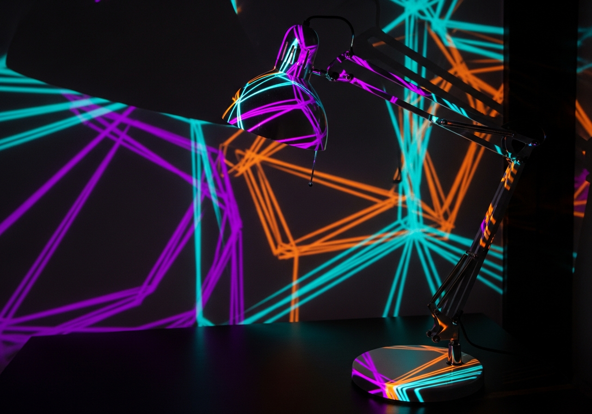

<p align="center">
  <video src="https://github.com/namanrajpal/LightMapAI/raw/main/docs/AWE_demo.mp4" width="100%" autoplay loop muted playsinline></video>
</p>

<p align="center">
  
</p>

<h1 align="center">LightMapAI</h1>
<p align="center">
  <strong>AI-Driven Projection Mapping for Ambient Spatial Computing</strong><br>
  Describe a visual effect in plain English → get a GPU shader → project it onto any physical surface.
</p>

<p align="center">
  <a href="#features">Features</a> •
  <a href="#quick-start">Quick Start</a> •
  <a href="#how-it-works">How It Works</a> •
  <a href="#built-in-effects">Effects</a> •
  <a href="#keyboard-shortcuts">Shortcuts</a> •
  <a href="#roadmap">Roadmap</a> •
  <a href="#license">License</a>
</p>

---

## Why LightMapAI?

Commercial projection mapping tools (MadMapper, Resolume) require expensive licenses and steep learning curves. LightMapAI is a free, open-source alternative that makes ambient spatial computing as simple as describing what you want to see. Built with **Godot 4.x** in under 3 MB.

> 🎤 Being presented at **AWE USA 2026** — June 15–18, Santa Clara, CA.

## Features

- **AI Shader Generation** — Describe visuals in natural language and get real-time GPU shaders
- **Perspective Homography Warping** — Pixel-precise corner calibration with real-time 3×3 matrix inversion
- **Multi-Surface Management** — Create, name, color, layer, and independently control unlimited projection surfaces
- **Timeline Animation** — Keyframe animation of opacity, color, visibility, z-order, geometry, and shader params with 5 easing types
- **Dual Output** — Setup UI on your laptop, clean projection on a secondary display simultaneously
- **Save / Load** — Full JSON serialization for portable, shareable show files
- **10+ Built-in Shader Effects** — Ready to use out of the box

## Quick Start

1. **Clone the repo**
   ```bash
   git clone https://github.com/namanrajpal/LightMapAI.git
   ```
2. **Open in Godot 4.6+** (GL Compatibility renderer)
3. **Press F5** to run — a default surface appears on the canvas
4. **Add surfaces**, drag corners to warp onto physical objects, and type a prompt to generate shader effects

## How It Works

```
┌─────────────────┐     ┌──────────────────┐     ┌─────────────────────┐
│  Natural Lang.  │────▶│  AI Shader Gen   │────▶│  GPU Fragment Shader│
│  "neon pulse"   │     │  (LLM → GLSL)    │     │  (real-time render) │
└─────────────────┘     └──────────────────┘     └──────────┬──────────┘
                                                            │
┌─────────────────┐     ┌──────────────────┐                ▼
│  Corner Calib.  │────▶│  Homography Warp │────▶  Projected onto surface
│  (4-point drag) │     │  (3×3 matrix)    │
└─────────────────┘     └──────────────────┘
```

**Architecture:**
- **SurfaceManager** — Central data store for all projection surfaces
- **SurfaceProxy** — Bridge nodes with exported properties that AnimationPlayer targets
- **TimelineManager** — Keyframe CRUD, playback control, JSON serialization
- **ShaderRegistry** — Manages built-in and AI-generated shader effects

## Built-in Effects

| Effect | Description |
|--------|-------------|
| Neon Pulse | Pulsating neon glow animation |
| Candle Flame | Realistic flickering flame simulation |
| Matrix Rain | Falling digital rain characters |
| Plasma | Classic plasma color waves |
| Voronoi Cells | Animated Voronoi diagram patterns |
| Electric Cracks | Branching electric discharge |
| Edge Glow | Glowing edge detection effect |
| Scan Lines | Retro CRT scan line overlay |
| Neon Border | Animated neon border frame |
| Breathing Frame | Gently pulsing border animation |

## Interface

```
┌──────────────────────────────────────────────────────────────┐
│ Toolbar: [+ Add] [Pattern ▾] [Grid ☐] [Save] [Load] [▶ Out]│
├──────────────┬───────────────────────────────────────────────┤
│   Sidebar    │                                               │
│              │         Projection Canvas                     │
│  Surface 1   │    ┌─────────────────────┐                    │
│  Surface 2   │    │   Surface (warped)  │                    │
│   ...        │    └─────────────────────┘                    │
│              │                                               │
├──────────────┴───────────────────────────────────────────────┤
│ Status Bar                                            SETUP  │
└──────────────────────────────────────────────────────────────┘
```

## Keyboard Shortcuts

| Key | Action |
|-----|--------|
| `Ctrl+S` | Save configuration |
| `Ctrl+L` | Load configuration |
| `Ctrl+N` | Add new surface |
| `Delete` | Delete selected surface |
| `G` | Toggle grid overlay |
| `Escape` | Exit output mode |

## Roadmap

- [ ] OSC / MIDI integration for live performance control
- [ ] Audio-reactive shader parameters (FFT analysis)
- [ ] Bezier edge warping for curved surfaces
- [ ] Multi-projector edge blending
- [ ] Cue list sequencer for show automation
- [ ] BPM sync for music-driven performances

## Tech Stack

- **Engine:** Godot 4.x (GL Compatibility)
- **Language:** GDScript
- **Shaders:** GLSL (Godot Shading Language)
- **Platforms:** macOS, Windows, Linux

## License

Open source. See [LICENSE](LICENSE) for details.

---

<p align="center">
  Made by <a href="https://github.com/namanrajpal">Naman Rajpal</a>
</p>
